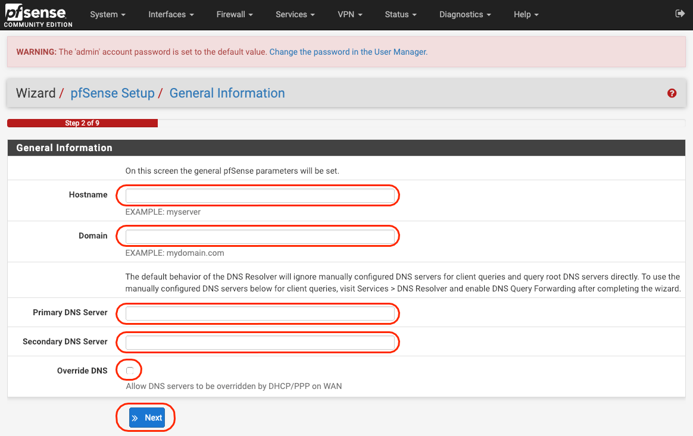
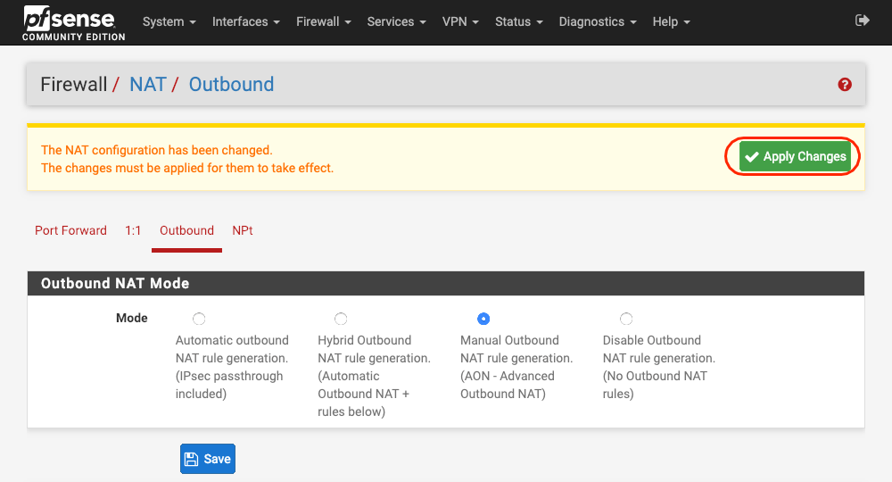
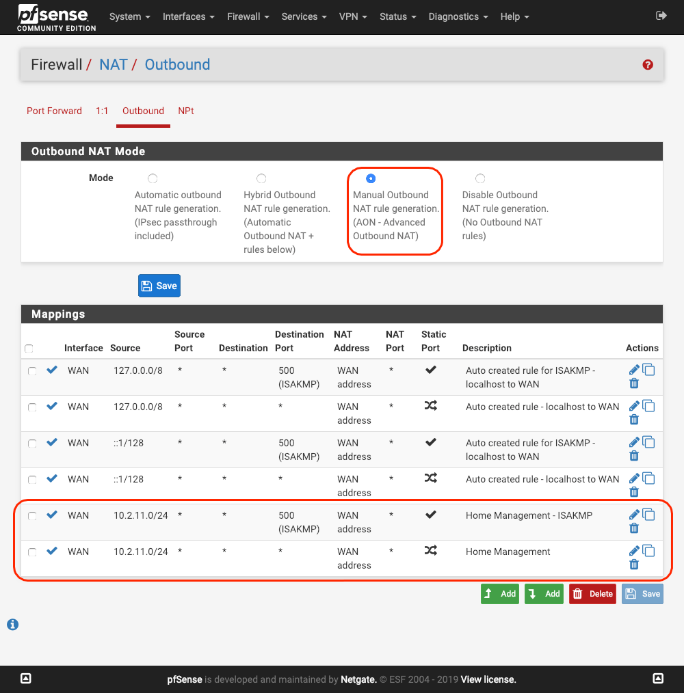
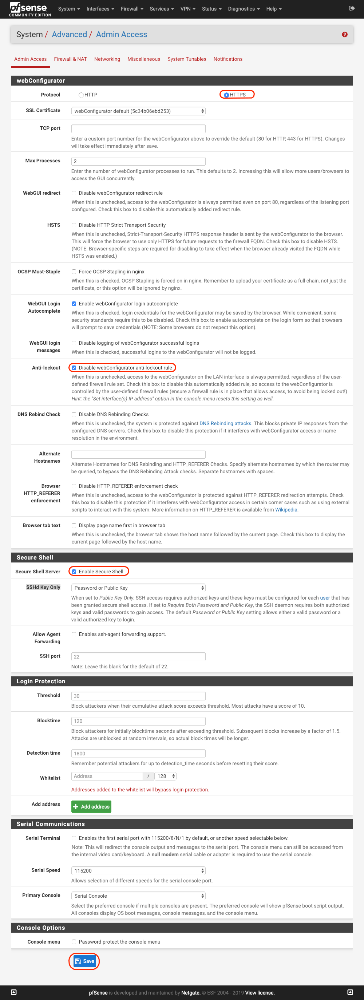
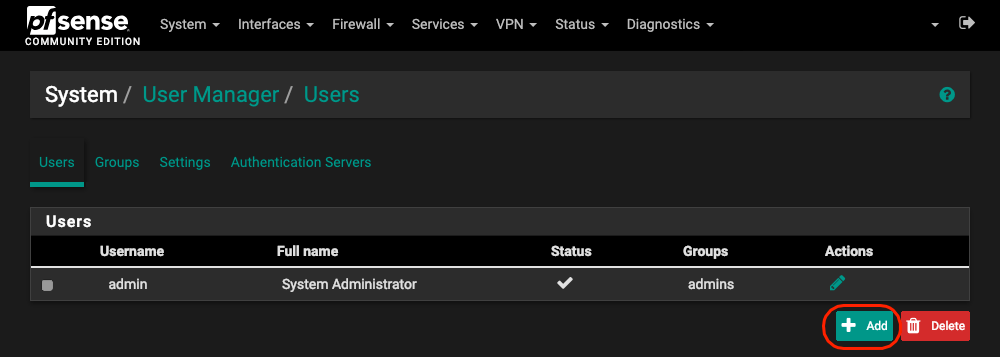
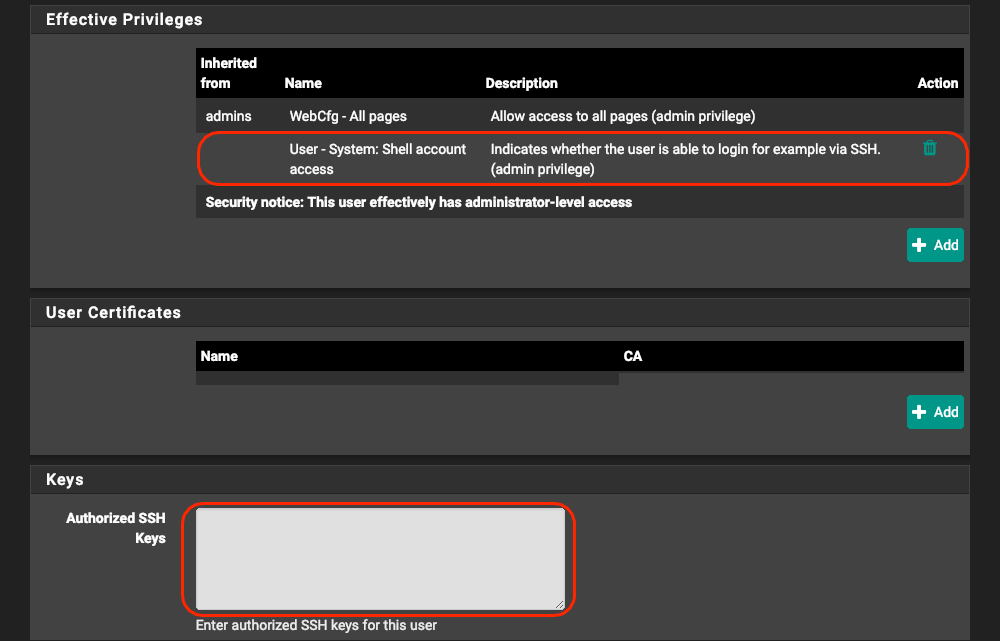
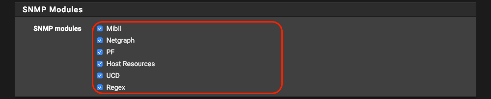

# pfSense

クラウド上に、 VPN サーバーを構築します。

pfSense とありますが、 pfSense を利用している理由は、pfSense の利用実績が多いので pfSense を利用しています。

## 初期設定

pfSense は、[Download pfSense Community Edition](https://www.pfsense.org/download/) でダウンロードできます。

64bit 版をダウンロードして、解凍して iso イメージの状態にまで頑張ってください。


### さくらのクラウドでインスタンス作成

!!! info
    TBD


### コンソールセットアップ

#### インストール


#### VLAN 設定

起動したら下記のような画面になります。


```
Should VLANs be set up now [y|n]? n

```

は、VLAN を利用してセットアップするかの設定になります。
さくらのクラウドや他のクラウドでも、 VLAN に対応しているクラウドはすくないため、 `n` と押します。


#### interface 設定


次に順番にインターフェイスの割当をしていきます。

| interface nemae | subnet    | description                                         |
| :-------------- | :-------- | :-------------------------------------------------- |
| vtnet0          | WAN       | グローバルアドレスがつくスイッチ                    |
| vtnet1          | LAN(MGMT) | `LAN` となってるが管理側のNIC(あとで名前を変える!!) |
| vtnet2          | LAN       | ユーザー側のNIC                                     |

!!! warning
    `vtnet` の部分の文字列は環境によって変更になることがあります。

順番、に設定していきます。


#### LAN(MGMT) interface の IP 設定


**`2) Set interface(s) IP address`** を選択したいので `2` を入力します。


!!! warning
    ②, ③ は毎回変わるはずなので要確認

| No.  |                                                                  |
| :--- | :--------------------------------------------------------------- |
| ①    | 上のリストから LAN(MGMT) に当たる `2` 番のインターフェイスを選択 |
| ②    | クラウド管理ネットワークのアドレス: `10.1.11.254`                |
| ③    | クラウド管理ネットワークのサブネットマスク: `24`                 |
| ④    | 何も設定せずに `Enter`                                           |
| ⑤    | 何も設定せずに `Enter`                                           |
| ⑥    | (DHCPサーバーは別途用意するので): `n`                            |
| ⑦    | 今後の設定は WebConfigurator を利用して実施するので: `y`         |
| ⑧    | ここに記載されているアドレスにブラウザでアクセス                 |
| ⑨    | 何も設定せずに `Enter`                                           |


この画面になれば、 赤枠の部分に設定したアドレスが表示されていることを確認

VPCルーターに VPN を張り、 今回だと `http://10.1.11.254` で管理画面が表示されることを確認してください。


### セットアップウィザード

pfSesne にログインします

!!! info
    pfSense の初期ユーザー, パスワードは下記の通りです

    | username | password |
    | :------- | :------- |
    | admin    | pfsense  |

#### pfSense Setup

フェルカムページです。


#### Netgate® Global Support is available 24/7

有償サポートの案内です


#### General Information

Hostname, Domain, Primary DNS Server, Secondary DNS Server, Override DNS を設定します。

|                      |                     |
| :------------------- | :------------------ |
| Hostname             | 指定の物を確認      |
| Domain               | 指定の物を確認      |
| Primary DNS Server   | 1.1.1.1             |
| Secondary DNS Server | 1.0.0.1             |
| Override DNS         | :fa-square: uncheck |




#### NTP

NTPの設定と TImezone を設定します

|                      |                     |
| :------------------- | :------------------ |
| Time server hostname | ntp.jst.mfeed.ad.jp |
| Timezone             | Asia/Tokyo          |


#### Configure WAN Interface

|                             |        |
| :-------------------------- | :----- |
| **Configure WAN Interface** |
| SelectedType                | Static |


|                  |      |
| :--------------- | :--- |
| IP Address       | 適宜 |
| Subnet Mask      | 適宜 |
| Upstream Gateway | 適宜 |


|                                |                         |
| :----------------------------- | :---------------------- |
| Block RFC1918 Private Networks | :fa-check-square: check |
| Block bogon networks           | :fa-check-square: check |


#### Set Admin WebGUI Password

パスワード変更


#### Wizard completed.

設定完了


## バージョンアップ確認&アップデート

`System` / `Update` をクリックしていく


Status が `Up to date.` でなく下記のように `confirm` と出ている場合はボタンを押してアップデートを実施


ダウンロードが完了したら自動的に再起動する。

ログイン画面が出ればアップデート完了.

## interface 設定

### Assignments

`Interfaces` / `Assignments` の順にクリック

下記の表になるように `Add` する

| interface | Network port |
| :-------- | :----------- |
| WAN       | vtnet0       |
| LAN       | vtnet1       |
| OPT1      | vtnet2       |


### WAN

先程、セットアップウィザード内で変更したので特に変更無し


### OPT1(MGMT)

インターフェイスが有効になっていることを確認

|                         |                         |
| :---------------------- | :---------------------- |
| Enable                  | :fa-check-square: check |
| Description             | `MGMT` に変更           |
| IPv4 Configuration Type | `Static IPv4`           |


|              |                                            |
| :----------- | :----------------------------------------- |
| IPv4 Address | クラウド管理ネットワークのIPアドレス       |
| subnet       | クラウド管理ネットワークのサブネットマスク |


### USER

一つ上の MGMT のインターフェイスを参考に ユーザー側のインターフェイス設定を実施してください。


## Firewall

Firewall の設定を実施します。

### Aliases

ここでは、 MANAGEMENT セグメントの IP, PORT リストを作成します。

その後、 rule で利用します

#### IP

MANAGEMENT の IP を設定する


**Properties**

|             |                       |
| :---------- | :-------------------- |
| Name        | mgmt_nets             |
| Description | Management Network(s) |
| Type        | Network(s)            |


**Host(s)**

|            |              |                          |
| :--------- | :----------- | :----------------------- |
| IP or FQDN | 10.1.11.0/24 | Cloud Management Network |
| IP or FQDN | 10.2.11.0/24 | Home Management Network  |

`Add Network` で適宜量を調整し MANAGEMENT ネットワークをすべて記載してください。<br>
最後に `Save` を押す


画面遷移後に `Apply Changes` が出るので忘れずに押しましょう。


#### Ports

MANAGEMENT で利用するポートを許可します。


**Properties**

|             |                    |
| :---------- | :----------------- |
| Name        | mgmt_ports         |
| Description | Management Port(s) |
| Type        | Port(s)            |


**Port(s)**

|      |      |         |
| :--- | :--- | :------ |
| Port | 22   | OpenSSH |
| Port | 80   | HTTP    |
| Port | 443  | HTTPS   |

`Add Port` で適宜量を調整し MANAGEMENT ネットワークをすべて記載してください。<br>
最後に `Save` を押す


画面遷移後に `Apply Changes` が出るので忘れずに押しましょう。


### NAT

NAT の設定を実施します。<br>
会場のネットワークの Gateway がこちらの pfSense になるため、会場側のネットワークの NAT を設定する必要があります。

`Firewall` > `NAT` > `Outbound` へ移動し<br>
`Manual Outbound NAT rule generation.(AON - Advanced Outbound NAT)` を選択します。
忘れずに `Save` しましょう。


画面遷移後に `Apply Changes` が出るので忘れずに押しましょう。




会場側 NAT を追加します。<br>
とりあえず、 MANAGEMENT 側を追加します。

|             |                 |                                |
| :---------- | :-------------- | :----------------------------- |
| Source      | 10.2.11.0/24    | 会場側の管理ネットワークを指定 |
| Description | Home Management |


画面遷移後に会場側 MANAGEMENT セグメントであるか確認してから `Apply Changes` を忘れずに押しましょう。


ISAKMP の NAT も追加します。
`Add` してこのように追加します。
画面遷移後に会場側 MANAGEMENT セグメントであるか確認してから `Apply Changes` を忘れずに押しましょう。


NATの設定は最終的にこうなっていれば OK です



### Rules

Firewall ルールを作成します。


#### WAN

IPsec を通すため設定を追加します。

| Protocol             | Source | Port | Destination | Port                   | Description                     |
| :------------------- | :----- | :--- | :---------- | :--------------------- | :------------------------------ |
| IPv4<br>ICMP echoreq | *      | *    | WAN addess  | *                      | Allow ICMP Echo request         |
| IPv4<br>ESP          | *      | *    | WAN addess  | 500<br> (ISAKMP)       | Allow ESP IP Protocol 50 Port   |
| IPv4<br>UDP          | *      | *    | WAN address | 4500<br> (IPsec NAT-T) | Allow ISAKMP 50/UDP             |
| IPv4<br>UDP          | *      | *    | WAN address | 4500<br> (IPsec NAT-T) | Allow IPsec NAT-T Port 4500/UDP |


#### MGMT

Management 用 Rule になります。

`Anti-Lockout Rule` は後で設定で無効化するので、管理側ネットワークから pfSense へアクセスできるように Rule を追加しています。

| Protocol    | Source     | Port | Destination | Port       | Description                         |
| :---------- | :--------- | :--- | :---------- | :--------- | :---------------------------------- |
| IPv4<br>TCP | !mgmt_nets | *    | MGMT addess | mgmt_poets | Management Access                   |
| IPv4 *      | MGMT net   | *    | *           | *          | Default allow MGMT to any rule      |
| IPv6 *      | MGMT net   | *    | *           | *          | Default allow MGMT IPv6 to any rule |


#### USER

ユーザー側 Rule です。

| Protocol | Source   | Port | Destination | Port | Description                         |
| :------- | :------- | :--- | :---------- | :--- | :---------------------------------- |
| IPv4 *   | USER net | *    | *           | *    | Default allow USER to any rule      |
| IPv6 *   | USER net | *    | *           | *    | Default allow USER IPv6 to any rule |


## System

### Advanced
#### Admin Access

**webConfigurator**

|              |                                                             |
| :----------- | :---------------------------------------------------------- |
| Protocol     | :fa-check-square: HTTPS                                     |
| Anti-lockout | :fa-check-square: Disable webConfigurator anti-lockout rule |

**Secure Shell**

|                     |                                       |
| :------------------ | :------------------------------------ |
| Secure Shell Server | :fa-check-square: Enable Secure Shell |
| SSHd Key Only       | `Password or Public Key`              |



!!! info
    今後は https 通信になります。
    自己証明書を利用した HTTPS 通信なので ブラウザーによっては セキュリティーエラーが出ますが無視します。

    自宅などで長期間利用する場合は、 acme などで Let's Encrypt を利用すると良いでしょう。


#### Firewall & NAT

ファイヤーウォール設定を変更します。

**Firewall Advanced**

|                               |                |
| :---------------------------- | :------------- |
| Firewall Optimization Options | `Conservative` |


#### Networking

**Network Interfaces**

|                                      |                                                             |
| :----------------------------------- | :---------------------------------------------------------- |
| Hardware Checksum Offloading         | :fa-check-square: Disable hardware checksum offload         |
| Hardware TCP Segmentation Offloading | :fa-check-square: Disable hardware TCP segmentation offload |
| Hardware Large Receive Offloading    | :fa-check-square: Disable hardware large receive offload    |


!!! warning
    この設定後は再起動が必要ですが、 Advance 設定完了後に実施しましょう。


#### Miscellaneous

**Cryptographic & Thermal Hardware**

|                        |                                                   |
| :--------------------- | :------------------------------------------------ |
| Cryptographic Hardware | `AES-NI and BSD Crypto Device (aesni, cryptodev)` |
| Thermal Sensors        | `Intel Core* CPU on-die thermal sensor`           |


!!! warning
    Advance 設定が完了したので 一度 pfSense を再起動します。

    `Diagnostics` / `Reboot` から実行できます.

    


## General Setup

**webConfigurator**

|                   |                               |
| :---------------- | :---------------------------- |
| Theme             | `pfSense-dark`                |
| Hostname in Menu  | `Fully Qualified Domain Name` |
| Dashboard Columns | `3`                           |


## User Manager
### Users

#### 管理ユーザーの追加

`Add` クリック



適宜変更する。<be>
忘れずに `Save` しましょう。


もう一度、作成したユーザーの設定画面を開き下記の `Add` をクリック


filter で shell を指定して `User - System: Shell account access` を追加。


`User - System: Shell account access` が追加されていることを確認<br>



#### admin アカウントの無効化

デフォルトアカウントの `admin` をセキュリティーの都合で無効化します。

|          |                                          |
| :------- | :--------------------------------------- |
| Disabled | :fa-check-square: This user cannot login |


## Services
### DNS Resolver
#### General Settings

IPsec Phase1 の重複排除機能を回避するために、ドメイン名を指定してレコードを `0.0.0.0` にすることで、事実上の回避をする。

サービスから DNS Resolver を選択します。


`add` をおして次の画面へ進む


| Host     | Parent domain of host | IP to return for host |
| :------- | :-------------------- | :-------------------- |
| onsite01 | conbu.net             | 0.0.0.0               |


画面遷移後に `Apply Changes` を忘れずに押しましょう。


### SNMP

**SNMP Daemon**

|        |                                                           |
| :----- | :-------------------------------------------------------- |
| Enable | :fa-check-square: Enable the SNMP Daemon and its controls |


**SNMP Daemon Settings**

|                       |             |
| :-------------------- | :---------- |
| Polling Port          | 161         |
| System Location       | CONBU Cloud |
| System Contact        | CONBU       |
| Read Community String | mekabu      |


**SNMP Modules**

|              |                                  |
| :----------- | :------------------------------- |
| SNMP modules | :fa-check-square: MibII          |
|              | :fa-check-square: Netgraph       |
|              | :fa-check-square: PF             |
|              | :fa-check-square: Host Resources |
|              | :fa-check-square: UCD            |
|              | :fa-check-square: Regex          |




**Interface Binding**

|                 |      |
| :-------------- | :--- |
| Bind Interfaces | MGMT |

`MGMT` インターフェイスのみ指定


